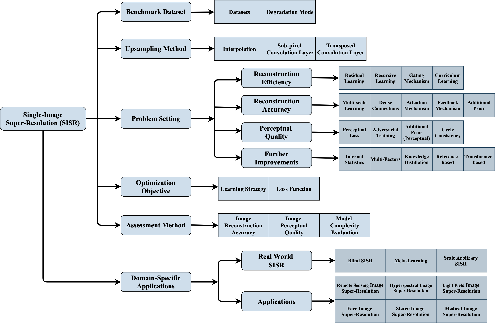

# SISR-Survey

### An investigation project for SISR.

### This repository is an official project of the paper "From Beginner to Master: A Survey for Deep Learning-based Single-Image Super-Resolution".

## Abstract

Single-image super-resolution (SISR) is an important task in image processing, which aims to enhance the resolution of imaging systems. Recently, SISR has made a huge leap and has achieved promising results with the help of deep learning (DL). In this survey, we give an overview of DL-based SISR methods and group them according to their targets, such as reconstruction efficiency, reconstruction accuracy, and perceptual accuracy. Specifically, we first introduce the problem definition, research background, and the significance of SISR. Secondly, we introduce some related works, including benchmark datasets, upsampling methods, optimization objectives, and image quality assessment methods. Thirdly, we provide a detailed investigation of SISR and give some domain-specific applications of it. Fourthly, we present the reconstruction results of some classic SISR methods to intuitively know their performance. Finally, we discuss some issues that still exist in SISR and summarize some new trends and future directions. This is an exhaustive survey of SISR, which can help researchers better understand SISR and inspire more exciting research in this field. 

## Purpose

Due to the pages and time limitation, it is impossible to introduce all SISR methods in the paper, and it is impossible to update the latest methods in time. Therefore, we use this project to assist our survey to cover more methods. This will be a continuously updated project! We hope it can help more researchers and promote the development of image super-resolution.

## Taxonomy

## Datasets

Benchmarks datasets for single-image super-resolution (SISR).

# SINGLE-IMAGE SUPER-RESOLUTION

## Reconstruction Efficiency Methods

## Perceptual Quality Methods

## Perceptual Quality Methods

## Further Improvement Methods

# DOMAIN-SPECIFIC APPLICATIONS

## Real-World SISR

## Remote Sensing Image Super-Resolution

## Hyperspectral Image Super-Resolution

## Light Field Image Super-Resolution

## Medical Image Super-Resolution

## Depth Map Super-Resolution

The depth map is an image or image channel that contains information relating to the distance of the surfaces of scene objects from a viewpoint. The use of depth information of a scene is essential in many applications such as autonomous navigation, 3D reconstruction, human-computer interaction, and virtual reality. However, depth sensors, such as Microsoft Kinect and Lidar, can only provide depth maps of limited resolutions. Hence, depth map super-resolution has drawn more and more attention recently. 

[1] <a href="https://link.springer.com/chapter/10.1007/978-3-319-54190-7_22">Deep Depth Super-Resolution: Learning Depth Super-Resolution Using Deep Convolutional Neural Network</a> 

[2] <a href="https://link.springer.com/chapter/10.1007/978-3-319-46487-9_17">Atgv-net: Accurate Depth Super-Resolution</a> 

[3] <a href="https://link.springer.com/chapter/10.1007/978-3-319-46487-9_22">Depth Map Super-Resolution by Deep Multi-Scale Guidance</a> 

[4] <a href="https://ieeexplore.ieee.org/stamp/stamp.jsp?arnumber=8443445">Deeply Supervised Depth Map Super-Resolution as Novel View Synthesis</a> 

[5] <a href="https://openaccess.thecvf.com/content_ICCV_2019/papers/Voynov_Perceptual_Deep_Depth_Super-Resolution_ICCV_2019_paper.pdf">Perceptual Deep Depth Super-Resolution</a> 

[6] <a href="https://openaccess.thecvf.com/content_CVPR_2020/papers/Song_Channel_Attention_Based_Iterative_Residual_Learning_for_Depth_Map_Super-Resolution_CVPR_2020_paper.pdf">Channel Attention based Iterative Residual Kearning for Depth Map Super-Resolution</a> 

## Stereo Image Super-Resolution

The dual camera has been widely used to estimate depth information. Meanwhile, stereo imaging can also be applied in image restoration. In the stereo image pair, we have two images with disparity much larger than one pixel. Therefore, full use of these two images can enhance the spatial resolution. 

[1] <a href="https://openaccess.thecvf.com/content_cvpr_2018/papers/Jeon_Enhancing_the_Spatial_CVPR_2018_paper.pdf">Enhancing the Spatial Resolution of Stereo Images Using A Parallax Prior</a> 

[2] <a href="https://openaccess.thecvf.com/content_CVPR_2019/papers/Wang_Learning_Parallax_Attention_for_Stereo_Image_Super-Resolution_CVPR_2019_paper.pdf">Learning Parallax Attention for Stereo Image Super-Resolution</a> 

[3] <a href="https://ieeexplore.ieee.org/stamp/stamp.jsp?arnumber=9206116">Parallax Attention for Unsupervised Stereo Correspondence Learning</a> 

[4] <a href="https://openaccess.thecvf.com/content_ICCVW_2019/papers/LCI/Wang_Flickr1024_A_Large-Scale_Dataset_for_Stereo_Image_Super-Resolution_ICCVW_2019_paper.pdf">Flickr1024: A Large-Scale Dataset for Stereo Image Super-Resolution</a> 

[5] <a href="https://ieeexplore.ieee.org/stamp/stamp.jsp?arnumber=8998204">A Stereo Attention Module for Stereo Image Super-Resolution</a> 

[6] <a href="https://openaccess.thecvf.com/content/CVPR2021W/NTIRE/papers/Wang_Symmetric_Parallax_Attention_for_Stereo_Image_Super-Resolution_CVPRW_2021_paper.pdf">Symmetric Parallax Attention for Stereo Image Super-Resolution</a> 

[7] <a href="https://ieeexplore.ieee.org/stamp/stamp.jsp?arnumber=9382858">Deep Bilateral Learning for Stereo Image Super-Resolution</a>  

[8] <a href="https://ojs.aaai.org//index.php/AAAI/article/view/6880">Stereoscopic Image Super-Resolution with Stereo Consistent Feature</a> 

[9] <a href="https://arxiv.org/pdf/2106.00985.pdf">Feedback Network for Mutually Boosted Stereo Image Super-Resolution and Disparity Estimation</a> 

# RECONSTRUCTION RESULTS

PSNR/SSIM comparison of lightweight SISR models (the number of model parameters less than 1000K) on Set5 (x4), Set14 (x4), and Urban100 (x4). Meanwhile, the training datasets and the number of model parameters are provided. Sort by PSNR of Set5 in ascending order. Best results are highlighted.

PSNR/SSIM comparison of large SISR models (the number of model parameters more than 1M, M=million) on Set5 (x4), Set14 (x4), and Urban100 (x4). Meanwhile, the training datasets and the number of model parameters are provided. Sort by PSNR of Set5 in ascending order. Best results are highlighted.

